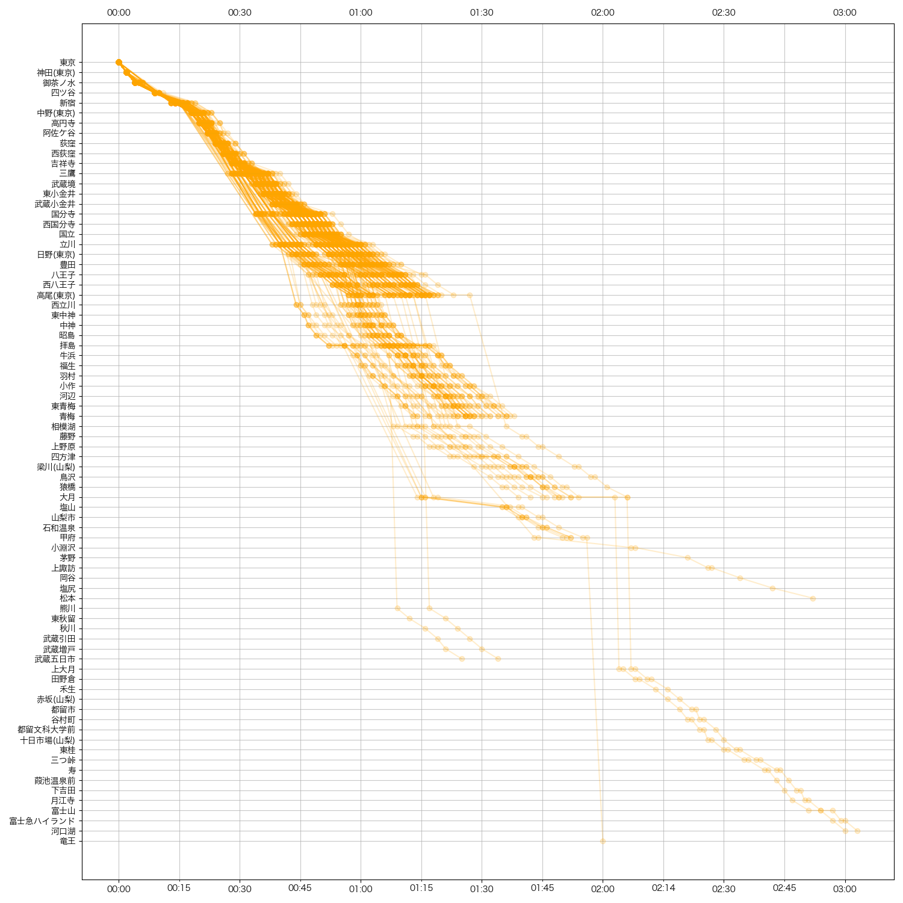
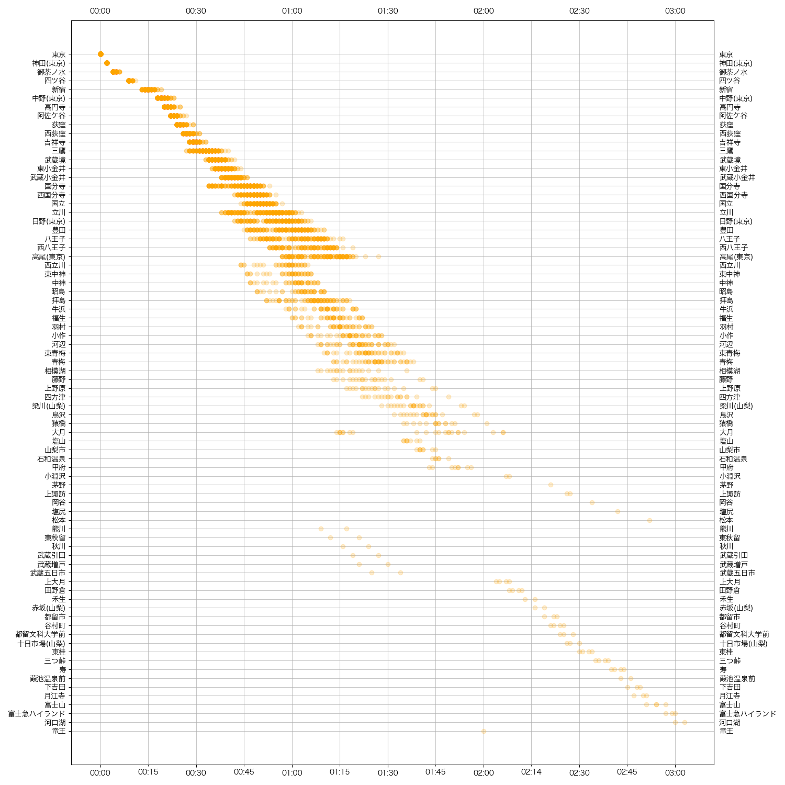

# train schedule diagram

A python script that scrapes [ekitan](ekitan.com/) (a Japanese transportation routing service) to make a train schedule diagram






# Install dependencies

Install the dependencies with `pip install -r requirements.txt`

# Running

Either edit main.py in this section to use your own url and line name

```py
    url = 'https://ekitan.com/timetable/railway/line-station/180-0/d1?dt=20211101'
    line_name = 'chuo'
    main(url, line_name)
```

Or from another python module, import `main` and call `main.main(url, line_name)`, giving your own `url` and `line_name`

Note that all the scripts will try its best to immediately return if their output file already exists (regardless if the file is correct). To force the scripts to run, delete their output files

# See also
- https://mbtaviz.github.io/
- https://blog.data.gov.sg/how-we-caught-the-circle-line-rogue-train-with-data-79405c86ab6a
- https://yewtu.be/watch?v=NFLb1IPlY_k
