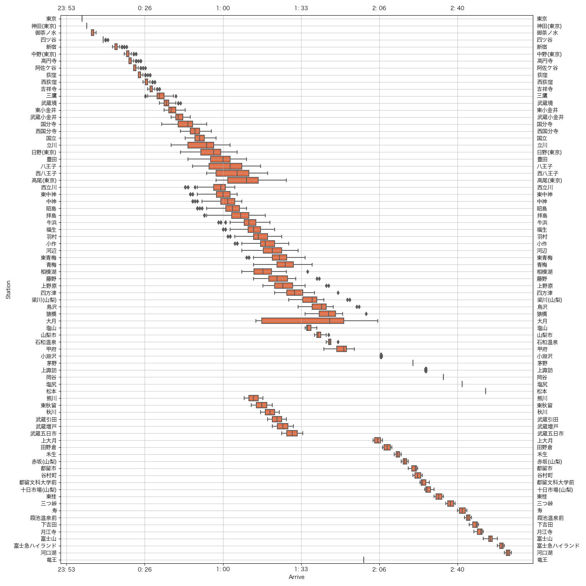
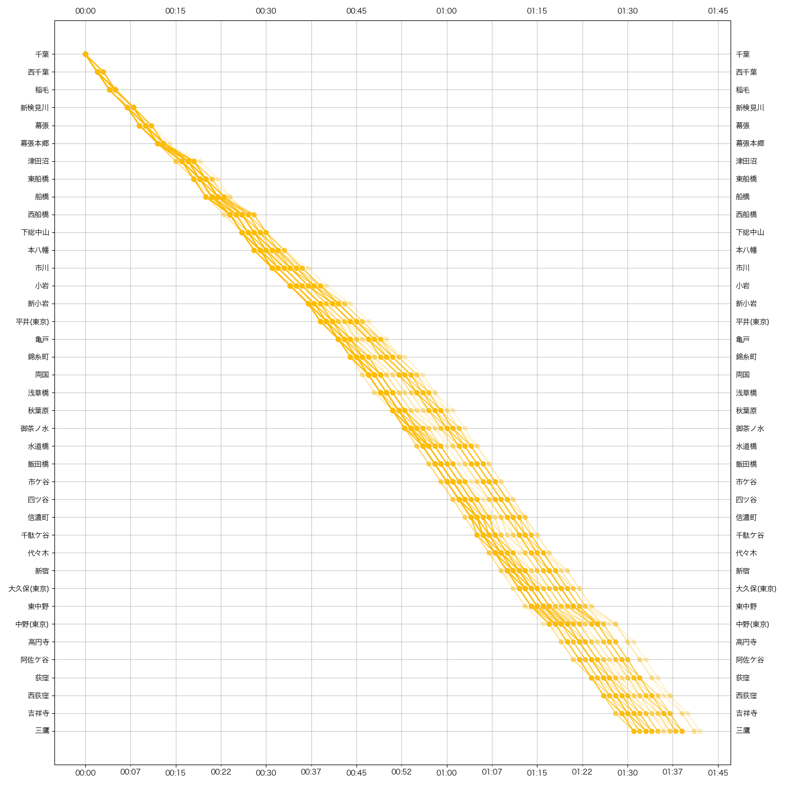
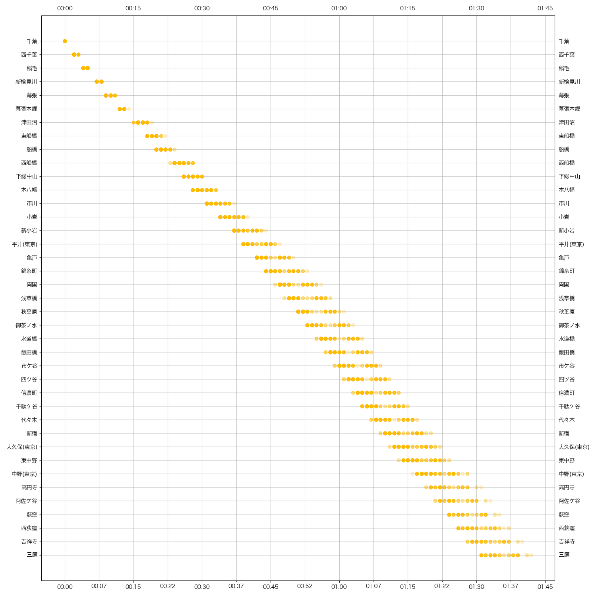
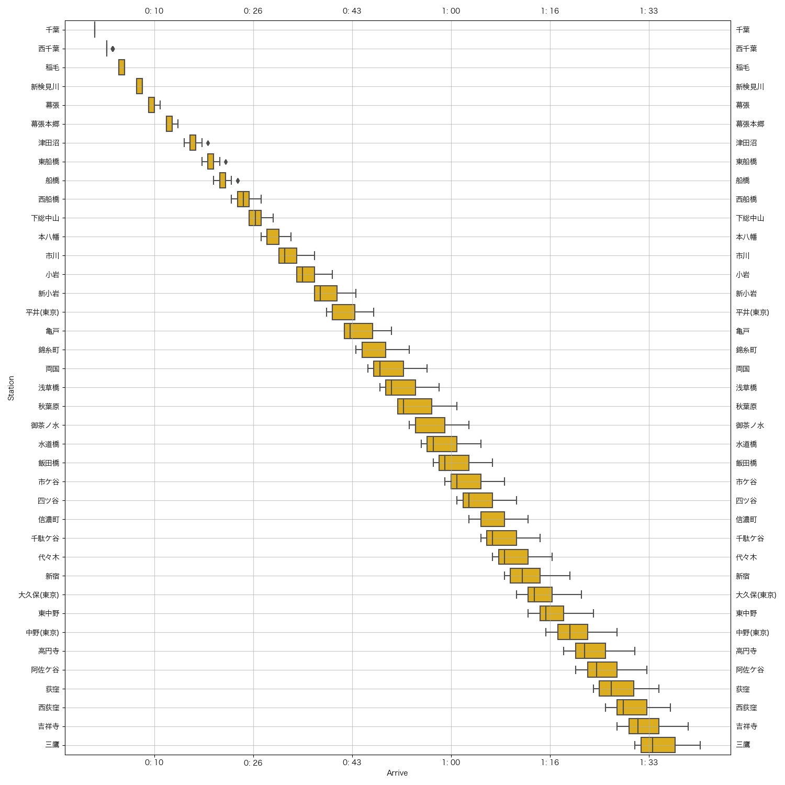
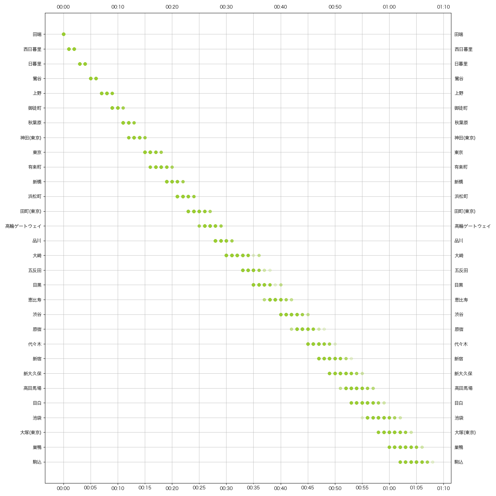
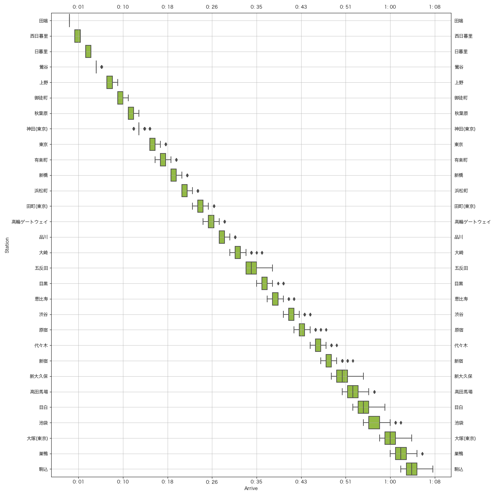
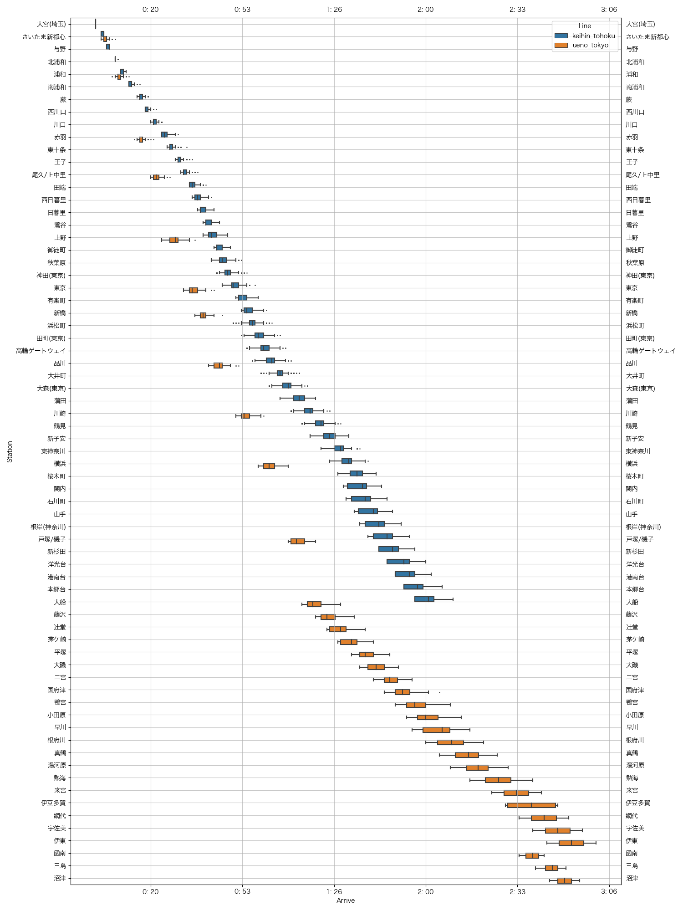

# train schedule diagram

A python script that scrapes [ekitan](ekitan.com/) (a Japanese transportation routing service) to make a train schedule diagram

chuo_normal

chuo_delta

chuo_delta_scatter

chuo_delta_box

chuo_sobu_normal

chuo_sobu_delta

chuo_sobu_delta_scatter

chuo_sobu_delta_box

keihin_tohoku_normal

keihin_tohoku_delta

keihin_tohoku_delta_scatter

keihin_tohoku_delta_box

ueno_tokyo_normal

ueno_tokyo_delta

ueno_tokyo_delta_scatter

ueno_tokyo_delta_box

yamanote_normal

yamanote_delta

yamanote_delta_scatter

yamanote_delta_box

keihin_tohoku_ueno_tokyo_combined_delta

keihin_tohoku_ueno_tokyo_combined_delta_scatter

keihin_tohoku_ueno_tokyo_combined_delta_box

keihin_tohoku_ueno_tokyo_yamanote_combined_delta

keihin_tohoku_ueno_tokyo_yamanote_combined_delta_scatter

keihin_tohoku_ueno_tokyo_yamanote_combined_delta_box

# Features

- Can start from any station, not just line terminus
- Multiple plotters available
    - Non-interactive matplotlib
    - Interactive bokeh
    - Interactive Altair/Vega (Note: rather slow for large data sets)

# Install dependencies

Install dependencies from `pyproject.toml`

Bokeh and Altair is optional, it is only used for interactive plots and depends on your choice

# Running

`python main.py`

# Editing

Either edit the bottom of main.py to use your own url and line name, and line color

Or from another python module, import `main` and call `main.main(line)`, giving your own `line`. To construct a `Line`, import `common` and call `common.Constants.Line`

Note that your url should be pinned to a specific date, not current results. See:

- NO: 'https://ekitan.com/timetable/railway/line-station/180-0/d1'
- YES: 'https://ekitan.com/timetable/railway/line-station/180-0/d1?dt=20211101'

All the scripts will try its best to immediately return if their output file already exists (regardless if the file is correct). To force the scripts to run, delete their output files

# Q&A

- Why not use the JR website? [Eg](https://www.jreast-timetable.jp/2112/timetable/tt1039/1039090.html)

Because it does not have arrival and departure time, only an instantaneous time

# See also
- https://mbtaviz.github.io/
- https://blog.data.gov.sg/how-we-caught-the-circle-line-rogue-train-with-data-79405c86ab6a
- https://yewtu.be/watch?v=NFLb1IPlY_k
